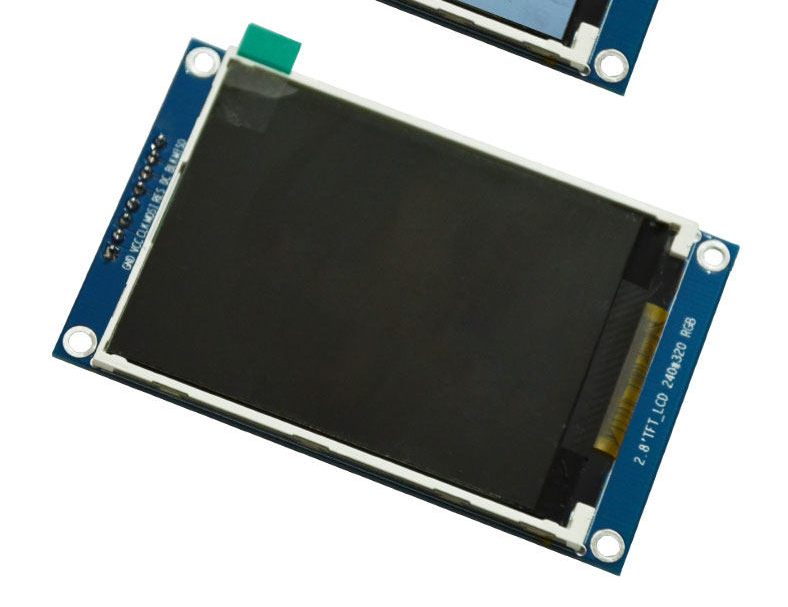

# 2.8″ TFT LCD Module (ST7789) — 240×320

> Photo is a **placeholder**; final product images will be updated later.

SPI colour display module for Arduino / ESP32 and similar boards.  
**Controller:** ST7789 · **Resolution:** 240 × 320 RGB · **Interface:** 4-wire SPI

Repository: [UGEelectronics/2.8inch-TFT-ST7789-Module](https://github.com/UGEelectronics/2.8inch-TFT-ST7789-Module)

---

## Product description

Compact **2.8-inch TFT** panel on a breakout PCB with a **7-pin** header. Intended for DIY electronics, IoT dashboards, meters, and handheld UIs.

| Item | Specification |
|------|----------------|
| Size | 2.8 inch diagonal |
| Resolution | **240 × 320** pixels |
| Colour | RGB, 16-bit (RGB565) |
| Driver IC | **ST7789** |
| Bus | SPI (SCK, MOSI) + CS + DC + RST |
| Logic / supply | **3.3 V** |
| Pins | **7** — see table below |
| Backlight | **Fixed on** — tied to 3.3 V on the PCB through a small resistor. The user **cannot** control backlight brightness or turn it off from a GPIO. |

### Header pinout (7 pins)

| Label | Function |
|--------|----------|
| **GND** | Ground |
| **3.3V** | Power (3.3 V only) |
| **CS** | SPI chip select |
| **RST** | Reset |
| **SCK** | SPI clock |
| **MOSI** | SPI data (MCU → LCD) |
| **D/C** | Data / Command |

There is **no backlight control pin** and **no MISO** pin on this product.

---

## Quick start (ESP32 + TFT_eSPI)

1. Install **Arduino IDE** and the **ESP32** board package (Espressif).
2. Library Manager → install **TFT_eSPI** by Bodmer.
3. Copy this repo’s setup file into the library (see [User guide](docs/USER_GUIDE.md)).
4. Select that setup in `User_Setup_Select.h`.
5. Wire the module, open `examples/ColorTest`, Upload.

### Recommended ESP32 wiring

| Module pin | ESP32 GPIO |
|------------|------------|
| GND | GND |
| 3.3V | **3.3 V** |
| CS | **2** |
| RST | **13** |
| SCK | **18** |
| MOSI | **23** |
| D/C | **12** |

These GPIOs match `TFT_eSPI_Setup/Setup_UGE_ST7789_ESP32.h`.

---

## Repository contents

| Path | Description |
|------|-------------|
| [`docs/USER_GUIDE.md`](docs/USER_GUIDE.md) | Full install, wiring, troubleshooting |
| [`TFT_eSPI_Setup/Setup_UGE_ST7789_ESP32.h`](TFT_eSPI_Setup/Setup_UGE_ST7789_ESP32.h) | Pin/driver file for TFT_eSPI |
| [`examples/ColorTest/`](examples/ColorTest/) | RGB colour test sketch |
| [`images/module.jpg`](images/module.jpg) | Placeholder product photo |

---

## Why configure `User_Setup_Select.h`?

TFT_eSPI’s **built-in examples** only include `<TFT_eSPI.h>`. They read pins from the library setup.

One library setup means:

- The colour test works
- Every TFT_eSPI example works with the same wiring
- Your own sketches need only `#include <TFT_eSPI.h>`

Details: [docs/USER_GUIDE.md](docs/USER_GUIDE.md)

---

## Licence

MIT — see [LICENSE](LICENSE).

© UGE Electronics
